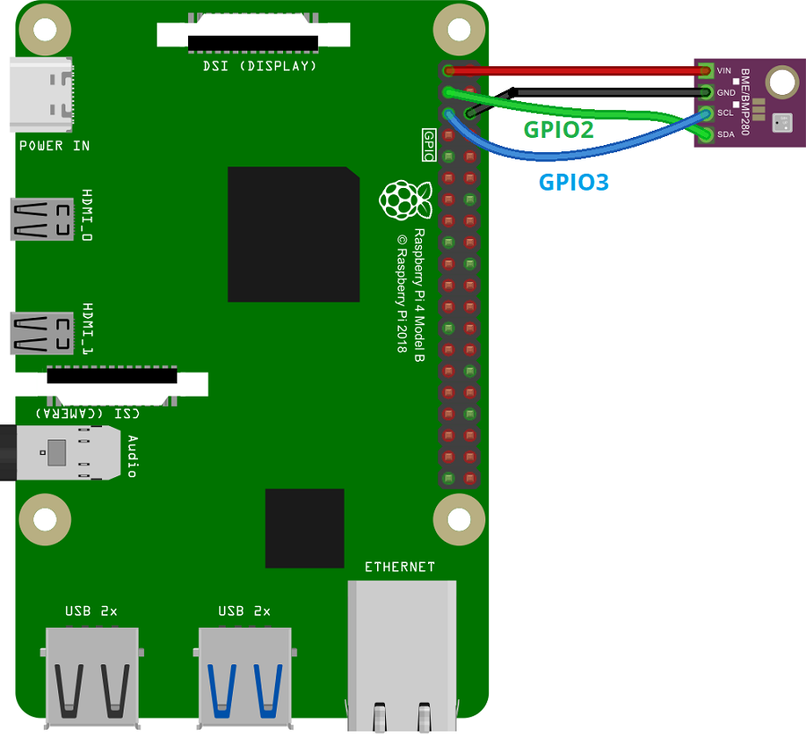

# Raspberry PI Weather Station

- powered by a Raspberry PI
- using a barometric sensor for temperature, humidity and pressure
- visualized using a webserver made with NiceGUI
- data is stored in a SQLite database
- E-Mail notifications for treshold violations via SMTP

## Needed Hardware

- Raspberry PI 4
- Power supply for Raspberry PI
- GY-BME280 (Sensor for temperature, humidity and pressure)
- 4 Jumper wires
- Breadboard (optional, for easier wiring)

## Wiring



|BME280|Raspberry Pi|
|-|-|
|Vin|3.3V|
|GND|GND|
|SCL|GPIO 3|
|SDA|GPIO 2|

Follow the following guide: <https://randomnerdtutorials.com/raspberry-pi-bme280-python/>

## Getting Started

- Install i2c-tools

```bash
sudo apt update
sudo apt install i2c-tools
```

- Enable i2c interface

```bash
sudo raspi-config
# Interfacing Options -> I2C -> Yes
```

- Install [uv](https://docs.astral.sh/uv/getting-started/installation/#__tabbed_1_1)
- Install git
- Clone the repository onto your Raspberry PI
- Install the dependencies using `uv sync`
- If you want to access the web interface from another device, you need to use port forwarding. You can use the following command to forward the port:

```bash
ssh -L 8080:localhost:8080 pi@pi
```

- Run the application using `uv run main.py`
- Open the web interface at `http://localhost:4444`

## 24/7 Operation

- To run the application 24/7, you can use `systemd` to create a service. Create a file called `weather-station.service` in `/etc/systemd/system/` like shown in the [weather-station.service](weather-station.service) file in this repository. Make sure to adjust the paths to your setup. Then you can enable and start the service using the following commands:

- Create a symbolic link to the service file

```bash
sudo ln -s /home/pi/Documents/weather-station/weather-station.service /etc/systemd/system/weather-station.service
```

- Enable the service

```bash
sudo systemctl enable weather-station.service
```

- Start the service

```bash
sudo systemctl start weather-station.service
```

- Check the status of the service

```bash
sudo systemctl status weather-station.service
```

- Check the logs of the service

```bash
sudo journalctl -u weather-station.service -f
```
